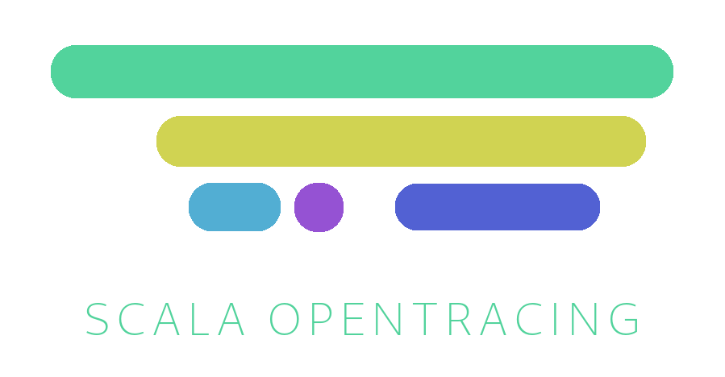

[  ](https://bintray.com/colisweb/maven/scala-opentracing/_latestVersion)

# Scala Opentracing

Scala Opentracing is a Scala wrapper around the Opentracing library for Java, along with utilities to monitor Http4s applications. It was originally
developed to address our needs for Datadog APM instrumentation at Colisweb.

It is being used in production at Colisweb.

## Goals

- **Provide Datadog instrumentation for our Scala applications** : this tracing library should work with any Opentracing compatible tracer,
like Jaeger, but it has only been tested with Datadog so far.
- **Stay out of the way** : we don't want the tracing system to get in the way of our business logic, so
- we try to reduce to a minimum the amount of boilerplate required to use this library. Furthermore, Spans
are automatically closed by a `Resource` from Cats effect for safety and convenience.
- **Be idiomatic** : we try to follow the principles of functional programming in Scala, and wrap all side-effects of the Java libraries into algebraic effects.

## Installation

Add our Bintray repository to your resolvers :

```scala
resolvers += Resolver.bintrayRepo("colisweb", "maven")
```

And add the library to your dependencies :

```scala
libraryDependencies += "com.colisweb" %% "scala-opentracing" % "0.1.0"
```

## Usage

## Creating a TracingContext explicitly

A `TracingContext[F[_]]` represents some unit of work, associated with a unique `spanId`, and which can spawn child units of work. This library provides
four instances of `TracingContext` so far: `OpenTracingContext`, `DDTracingContext`, `LoggingTracingContext` and `NoOpTracingContext` that does nothing in particular.

If you use Datadog, create a `DDTracingContext`, otherwise use `OpenTracingContext`. Both will rely on some `Tracer`, provided by whatever tracing
library you use (Jaeger, Datadog ...).

In examples, we'll use `IO` from Cats effect as our `F` but you can use any monad that satisfies the `Sync` Typeclass, like `Task` from Monix.

```scala
import io.opentracing._
import com.colisweb.tracing._

val tracer: Tracer = ???
val tracingContextBuilder = OpenTracingContext[IO, Tracer, Span](tracer) _
```
### Creating a TracingContext for Datadog

Datadog requires that you create a tracer and then register it as the "Global tracer" for your application. For convenience and purity, this library
includes a utility method that will create and register the tracer for you, and return an `F[TracingContextBuilder[F]]`.

```scala
import com.colisweb.tracing.datadog._

val tracingContextBuilderIO: IO[TracingContextBuilder[IO]] = DDTracingContext.getDDTracingContextBuilder[IO]("your-service-name")
```

Don't evaluate this effect multiple times, as it will recreate a new tracer every time. Instead, use it in the *main* of your application, and propagate
the `TracingContextBuilder` down where you need it.

### Logging all your traces for development

For development or fast prototyping purposes, you can also use `LoggingTracingContext`, that will log all your operations to the standard
output, along with the time every operation took in milliseconds.

```scala
val tracingContextBuilder = LoggingTracingContext[IO]() _
```

To see the logs, make sur the `trace` level is enabled in SLF4J.

Once you have a `TracingContextBuilder[F[_]]`, you can use to wrap your computations.

```scala
// You can pass tags as a Tags
val result: IO[Int] = tracingContextBuilder("Heavy mathematics", Map.empty) use { _ =>
  IO { 42 - 5 }
}
```

Notice how the context is wrapped inside a `Resource[IO, TracingContext]`. This means the span will
automatically closed at the end of the computation. You can use the `TracingContext` you get from the
`Resource` to create a child computation :

```scala
val result: IO[Int] = tracingContextBuilder("Parent context", Map.empty) use { parentCtx =>
  // Some work here ...
  parentCtx.childSpan("Child context") use { _ =>
    IO { /* And some work there */ }
  } *> parentCtx.childSpan("Sibling context") use { _ =>
    IO { 20 + 20 }
  }
}

// Result value will 20. The Spans graph will look like this :
// <------------------ Parent context ------------------>
//   <---- Child context ----> <---- Sibling context -->
```

If you don't need to create child contexts, you can import the `wrap` convenience method
by importing `com.colisweb.tracing.implicits._`.

```scala
import com.colisweb.implicits._

val result: IO[Int] = tracingContextBuilder("Parent context", Map.empty) wrap IO {
  // Some work
  78 + 12
}
```

## Working with monad transformers (OptionT, EitherT)

Sometimes, you will need to trace a computation and get back an `EitherT[F, Error, B]` or `OptionT[F, A]` instead
of a regular `F[A]`. For convinience, this library also provides the `either` and `option` operations on `Resource[F, A]`.

```scala
import com.colisweb.tracing.implicits._

val computation: Option[IO, Int] = ???

val result: OptionT[IO, Int] = tracingContextBuilder("Parent context", Map.empty) option computation
```

```scala
import com.colisweb.tracing.implicits._

val computation: EitherT[IO, Throwable, Int] = ???

val result: EitherT[IO, Throwable, Int] = tracingContextBuilder("Parent context", Map.empty) either computation
```

## Tracing Http4s services

This library provides `TracedHttpRoutes[F[_]]`, a function that works just like `HttpRoutes.of` from Http4s, except in wraps
all requests in a tracing context, which you can retrieve in your routes to instrument subsequent computations.

To create a `TracedHttpRoutes[F[_]]`, you will need an implicit `TracingContextBuilder[F[_]]` in scope. You can then retrieve the
tracing context with the `using` extractor from `com.colisweb.tracing.TracedHttpRoutes._`

```scala
import org.http4s.dsl.io._
import com.colisweb.tracing.http4s.TracedHttpRoutes
import com.colisweb.tracing.http4s.TracedHttpRoutes._
import com.colisweb.tracing.TracingContextBuilder

object MyRoutes {
  def routes(implicit tracingContextBuilder: TracingContextBuilder[IO]): HttpRoutes[IO] =
    TracedHttpRoutes[IO] {
      case (req @ POST -> Root / "endpoint") using tracingContext =>
        val result = tracingContext.childSpan("Some computation") wrap IO {
          // Something here ...
        }

        result.flatMap(Ok(_))
    }
}
```

### Using Tapir

[tapir](https://github.com/softwaremill/tapir), or *Typed API descRiptions* is a fantastic library
that allows you to define http endpoints using Scala's type system, and separate those definitions
from your actual business logic. Tapir definitions can be *interpreted* into http4s `HttpRoutes`.

The package `scala-opentracing-tapir` provides a small integration layer that allows you
to create traced http endpoints from tapir `Endpoint` definitions.

```
libraryDependencies += "com.colisweb" %% "scala-opentracing-tapir-integration" % "0.1.0"
```

```scala
import cats.effect.IO
import tapir._
import com.colisweb.tracing.tapir._

val myEndpoint: Endpoint[Unit, Unit, String, Nothing] =
  endpoint.get.in("/hello").out(stringBody)

val routes: HttpRoutes[IO] = myEndpoint.toTracedRoute[IO](
  (input, ctx) => ctx.childSpan("Some description") use { _ =>
    IO.pure(Right("OK"))
  }
)
```

You will need an implicit `ContextShift[F]` in scope for this to work. Take a look
at the [tests](./tapir/src/test/scala/com/colisweb/tracing/tapir/TapirSpec.scala) for 
further examples.

If your error type extends `Throwable`, you can also use `toTracedRouteRecoverErrors`, a traced
equivalent of `toTracedRoute` from `tapir-http4s-server`.

## Correlating your logs

If you want to link your traces and your logs together, you can do it manually by adding the `traceId` of the context
to your messages.

```scala
val result: IO[Int] = tracingContextBuilder("Heavy mathematics", Map.empty) use { ctx =>
  ctx.traceId.value flatMap { traceId =>
    logger.debug("Doing stuff. Trace id : {}", traceId)
  } *> IO {
    // Some computation here
  }
} 
```

### Automatic correlation for Datadog

For people who use Datadog, we provide a wrapper around `Logger` from SLF4J that will automatically
add the `spanId` and `traceId` to your logs. The logging side-effect is already wrapped in `F` for
purity.

```scala
import org.http4s.dsl.io._
import com.typesafe.scalalogging.StrictLogging
import com.colisweb.tracing.http4s.TracedHttpRoutes
import com.colisweb.tracing.http4s.TracedHttpRoutes._
import com.colisweb.tracing._

object MyRoutes extends StrictLogging {
  // You will need an implicit Logger from slf4j to use the logging facility
  implicit val slf4jLogger: org.slf4j.Logger = logger.underlying

  def routes(implicit tracingContextBuilder: TracingContextBuilder[IO]): HttpRoutes[IO] =
    TracedHttpRoutes[IO] {
      case (req @ POST -> Root / "endpoint") using tracingContext =>
        val result = tracingContext.childSpan("Some computation") use { ctx =>
          ctx.logger.debug("Doing stuff") *> IO {
            // Something here ...
          }
        } 

        result.flatMap(Ok(_))
    }
}
```

## Contributing

Pull requests are welcome. For major changes, please open an issue first to discuss what you would like to change.

Make sure to follow our [Code of Conduct](./CODE_OF_CONDUCT.md).

Here are some ideas of improvements :

- Right now this library does not support distributed tracing, i.e the ability to continue a serialized
trace from another application and/or send an unfinished trace to another application.
- The `LoggingTracingContext` does not support tags at the moment. Adding tags to a `LoggingTracingContext` will have
no effect.

## License

[MIT](./LICENSE.md)
